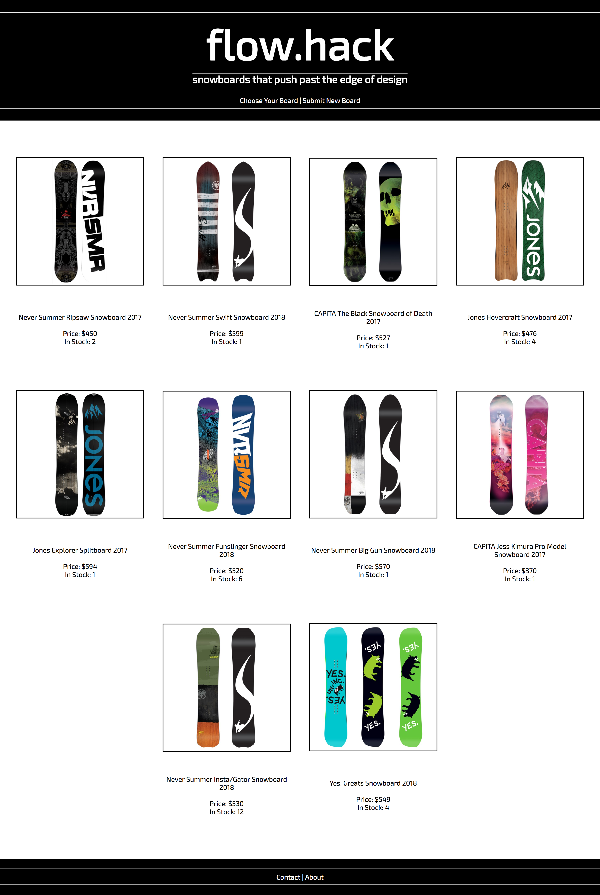
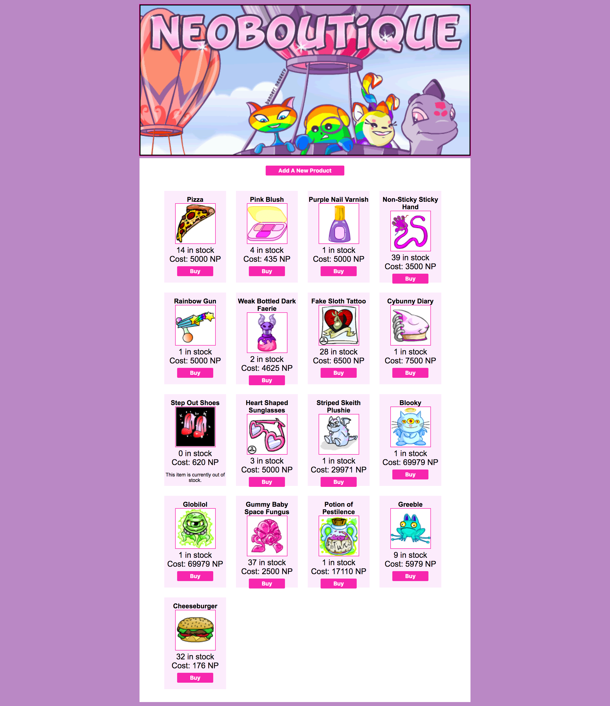

# Full Stack Portfolio Project: Store Application

This application adheres to the guidelines and rubric presented in the Full Stack Personal Portfolio Project. By following the project specifications below, you should be able to complete the project. All that is required is a theme for your store.

## Overview

You will create a full-stack application that mimics an online store. You may choose any theme and product you like for your store. To complete the store application, you will do the following:

- Use Express and PostgreSQL to build a back-end application with persistent data.
- Use the `create-react-app` package to build a front-end with React.
- Create a full-stack application by connecting the back-end and front-end applications.
- Deploy your project online.
- Have a 1:1 interview with an instructor.

### Examples

The following are some examples of themes and designs for your store.

<details><summary>Inspiration 1</summary>



</details>

<details><summary>Inspiration 2</summary>



</details>

## Application specifics

To complete this project, follow the details below.

### Back-end application

Follow the initialization process you've learned in class for creating a back-end application. Then, complete the following steps.

#### Basic setup

Start by creating server files and relevant folders for your application. Install necessary packages, including those needed for development such as `nodemon`, and create any configuration files needed. Create an Express error handler and a catch-all route that will respond with a 404 when a request is made to the server.

This step will be complete when you have a server that can run and respond to any request with a 404 message.

#### Database creation

Next, you should create a `products` table. The following fields should be present on the `products` table. You should then create appropriate seeds and migrations for the `products` table.

| Field name  | Data type      | Additional details                                           |
| :---------: | -------------- | ------------------------------------------------------------ |
|     id      | integer        | Should be auto-incrementing and set as the primary key.      |
|    name     | string         | Should be required.                                          |
| description | string or text | ---                                                          |
|    price    | integer        | Consider storing as a representation in cents. Default to 0. |
|   rating    | integer        | Should be required and should be a value between 0 and 5.    |
|  featured   | boolean        | Should default to false.                                     |

You may wish to add other fields such as an `image_url` or properties like `size` or `color` depending on the theme you've chosen.

#### Routing

Next, you will want to create routes that make it possible to access your product resource. The following describes the RESTful routes you should create.

|  #  | Action  |      URL      | HTTP Verb |    CRUD    |                Description                |
| :-: | :-----: | :-----------: | :-------: | :--------: | :---------------------------------------: |
|  1  |  Index  |   /products   |    GET    |  **R**ead  |   Get a list (or index) of all products   |
|  2  |  Show   | /products/:id |    GET    |  **R**ead  | Get an individual view (show one product) |
|  3  | Create  |   /products   |   POST    | **C**reate |           Create a new product            |
|  4  | Destroy | /products/:id |  DELETE   | **D**elete |             Delete a product              |
|  5  | Update  | /products/:id |    PUT    | **U**pdate |             Update a product              |

Once you have completed these routes, you should be able to perform full CRUD actions on your API.

#### Deploy

Deploy your back-end application to the web. You should not need to make any special changes for the deployed version of your back-end application.

### Front-End

Follow the initialization process you've learned in class for creating a back-end application. Then, complete the following steps.

#### Basic setup

Using `create-react-app`, create a new React application. Remove any unneeded or unused files and ensure you can get the basic template up and running.

> **Note:** If you are building a project where your back-end and front-end are in the same repository, be careful not to accidentally add two `.git` folders to your project when running `create-react-app`.

#### Create your views

Create all of the main views for your product resource. While it is possible to create the views separately and then connect them to the back-end, you may find it easier to connect the back-end to the front-end at the same time you are creating the views. The choice is yours.

|  #  | Action |        URL         |                     Description                     |
| :-: | :----: | :----------------: | :-------------------------------------------------: |
|  1  | Index  |     /products      | Display all products available on the application.  |
|  2  |  Show  |   /products/:id    |              Display a single product.              |
|  3  |  New   |   /products/new    |   Show a form where you can create a new product.   |
|  4  |  Edit  | /products/:id/edit | Show a form where you can edit an existing product. |

On the Show page, allow for the ability to delete the product the user is viewing. Upon completion, the user should be redirected back to the home page.

#### Deploy

Deploy your application to the web. Once both your front-end and back-end applications are deployed, you should have a fully deployed full-stack application.

### Additional features

As part of completing this project, you should create additional features that are not detailed above. Work with your instructor to choose one or more of the following features to complete.

#### Display errors in the New and Edit forms

On the front-end application, display sensible errors to the user if they try creating an invalid product. For example, you may want to respond with an error if no name is provided or if the rating is an incorrect value.

Display these errors _before_ any requests are made to the back-end.

#### Use query parameters to filter responses

On the back-end application, check for query parameters in the `GET /products` route. Check for the following query parameters described in the table below.

| Query parameter |        Example request        |                             Description                             |
| :-------------: | :---------------------------: | :-----------------------------------------------------------------: |
|    featured     | `GET /products?featured=true` | Only returns products where `featured` is equal to the given value. |
|     rating      |   `GET /products?rating=4`    | Returns all products where the rating is equal to the given value.  |

It should be possible to use multiple query parameters. For example, the following request should return all products that are featured and have a rating of 2.

```
GET /products?featured=true&rating=2
```

For the rating query parameter, multiple ratings can be specified. For example, the following request should return all products that have a rating of _either_ 3, 4, or 5.

```
GET /products?rating=3&rating=4&rating=5
```

#### Allow for visually filtering products

On the front-end application, create three buttons on your Index page:

1. Show All
1. Featured Products
1. Highly-Rated Products

When the Index page is loaded, show all products. When the **Featured Products** button is pressed, only those products that are featured should show. If the **Highly-Rated Products** button is pressed, only those products where the rating is 4 or 5 should show.

## Interview requirements

In preparation for meeting with your instructor, prepare the following.

1. Consider how you wish to present your application to your instructor. Describe why you are passionate or interested in the application's theme.

1. Choose one front-end feature that you plan to describe with your instructor. Practice describing the feature on your own using technical language. For example, if you choose to describe how a user can Delete a product on your application, discuss what components you use and how the button click translates to a back-end request.

1. Choose one back-end feature that you plan to describe with your instructor and follow the same process as above. Use technical language in describing the feature whenever possible. For example, if you choose to describe how your Create route works, use specific terminology like request, response, and middleware.
